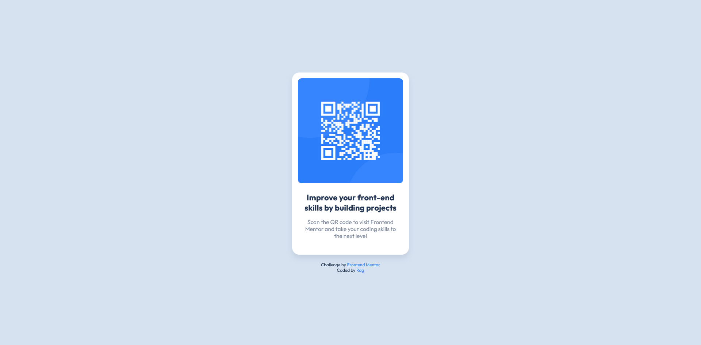

# Frontend Mentor - QR code component solution

This is a solution to the [QR code component challenge on Frontend Mentor](https://www.frontendmentor.io/challenges/qr-code-component-iux_sIO_H). Frontend Mentor challenges help you improve your coding skills by building realistic projects. 

## Table of contents

- [Overview](#overview)
  - [Screenshot](#screenshot)
  - [Links](#links)
- [My process](#my-process)
  - [Built with](#built-with)
  - [What I learned](#what-i-learned)
- [Author](#author)
- [Acknowledgments](#acknowledgments)

## Overview

### Screenshot



### Links

- Solution URL: [Solution](https://github.com/ragonscreen/frontend_mentor-qr_code_component/tree/main)
- Live Site URL: [Live Site](https://ragonscreen.github.io/frontend_mentor-qr_code_component/)

## My process

### Built with

- Semantic HTML5 markup
- CSS custom properties
- Flexbox
- Mobile-first workflow

### What I learned

Setting a padding value to a container with an image inside, and setting the image width as 100%, and display as block auto fits the image size.

```html
<div id="image-container">
  
</div>
```

```css
div {
  padding: 16px;
}

img {
  display: block;
  width: 100%;
  margin: 0 auto;
}
```

## Author

- Frontend Mentor - [@ragonscreen](https://www.frontendmentor.io/profile/ragonscreen)

## Acknowledgments

- I would like to thank [Kevin Powell](https://www.youtube.com/@KevinPowell) for introducing me to Frontend Mentor and his other awesome CSS guides.
